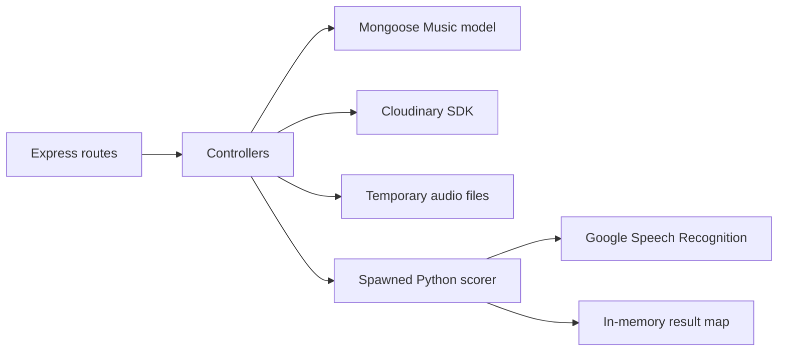

# Backend Architecture

## Executive summary

The backend is a compact Express 4 service written in TypeScript. It exposes catalog/upload/scoring routes, persists music metadata in MongoDB through Mongoose, stores media in Cloudinary, and delegates speech scoring to a spawned Python script. The design is a controller-centric layered service with an asynchronous worker path, but it lacks durable job infrastructure, request validation, authentication, and production packaging.

## Technology stack

| Category | Technology | Declared version | Role |
|---|---|---:|---|
| Runtime | Node.js | not pinned | Express host and subprocess orchestration. |
| Language | TypeScript | `^5.8.2` | Strict CommonJS backend source. |
| HTTP | Express | `^4.21.2` | Routes, JSON middleware, and listener. |
| Database | MongoDB / Mongoose | `^6.15.0` / `^8.13.1` | Music document persistence. |
| Media storage | Cloudinary | `^2.6.0` | Hosted music, instrumental, and artwork uploads. |
| Uploads | Multer | `^1.4.5-lts.2` | In-memory catalog uploads and disk score uploads. |
| Process | Python + speech_recognition + pydub | unpinned | Chunking, Google recognition, similarity scoring. |
| Tooling | ts-node / nodemon | `^10.9.2` / `^3.1.9` | Development execution and restart. |

## Architectural pattern

Routes call controllers directly. Controllers combine validation, business rules, infrastructure access, response mapping, and logging. The score path acknowledges work before the subprocess completes and exposes results through polling.

## API design

Five application endpoints and one root response are documented in [Backend API Contracts](./api-contracts-backend.md). There is no API prefix/version, authentication, authorization, rate limiting, OpenAPI definition, centralized validation, or consistent job/error model.

## Data architecture

MongoDB holds one `Music` collection; scoring results are ephemeral. See [Backend Data Models](./data-models-backend.md). There are no migrations, indexes, seeds, or transactional cleanup across MongoDB and Cloudinary.

## Speech-scoring pipeline

1. Multer writes the browser audio upload to `uploads/`.
2. The controller loads expected lyrics from MongoDB and creates a UUID request ID.
3. A Python process converts audio to 16 kHz mono and writes five-second `chunk_<n>.wav` files.
4. Each chunk is sent to Google Speech Recognition.
5. `SequenceMatcher` compares transcription and lyrics; the implementation multiplies similarity by six, adds a failure-derived bonus, and caps at 100.
6. The result is stored in memory for five minutes.

The fixed chunk filenames create cross-request collision risk, the score formula is not calibrated or tested, and recognition errors are not propagated into a terminal job state.

## Configuration and security

Required environment keys are `DB_USER`, `DB_PASS`, `CLOUDINARY_CLOUD_NAME`, `CLOUDINARY_API_KEY`, and `CLOUDINARY_API_SECRET`. `OPENAI_API_KEY` exists locally but no code references it. Secrets are ignored by Git; however, `app.ts` logs `DB_USER` and `DB_PASS` at startup, which is a critical credential exposure.

Other material gaps include open CORS, unauthenticated expensive/upload endpoints, no upload limits/file filters, hard-coded MongoDB host and port 3000, and verbose process output.

## Development and build

- Install JavaScript packages: `npm install`
- Start development server: `npm start`
- Type-check: `./node_modules/.bin/tsc --noEmit`
- Compile: `./node_modules/.bin/tsc` (no package script is defined)

Python prerequisites are undocumented and unpinned. At minimum the worker requires Python, `SpeechRecognition`, `pydub`, and an FFmpeg binary available to pydub. The Google recognizer requires outbound network access.

Backend TypeScript compilation completed successfully on 2026-08-02. The declared `npm test` intentionally exits with an error; no tests exist.

## Deployment architecture

No backend deployment, container, process manager, health/readiness probe, CI workflow, or production start command exists. The service starts listening only after MongoDB connects. Production deployment must provide Node.js, Python, Python packages, FFmpeg, writable temporary directories, MongoDB/Cloudinary credentials, outbound speech-provider access, and cleanup/monitoring.

## Principal risks

1. Database credentials are printed to logs.
2. Music upload and scoring are unauthenticated and lack size/type/rate limits.
3. Score jobs/results are process-local and unreliable across restarts or multiple instances.
4. Python subprocess failures can leave requests polling forever; there is no timeout or `error` handler.
5. Concurrent Python jobs share `chunk_0.wav`, `chunk_1.wav`, and similar names.
6. `getMusic` can send both 404 and 200 responses because it does not return after not-found.
7. Python dependencies, FFmpeg, Node version, and production run/build steps are not pinned.
8. External systems are tightly coupled inside controllers and are not covered by tests.

