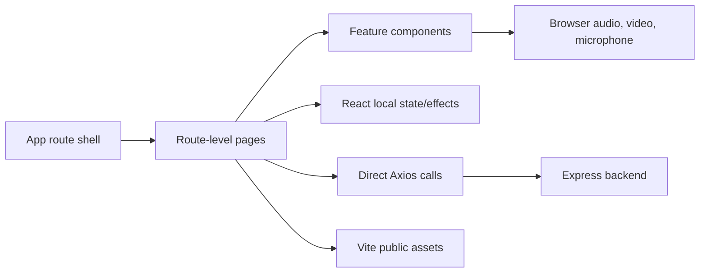

# Frontend Architecture

## Executive summary

The frontend is a React 19 single-page karaoke application built by Vite. It presents a strongly animated Persona-inspired interface, loads catalog data from the backend, streams hosted music/video assets, records microphone audio in the browser, submits the recording for scoring, and polls for the result. Architecture is route-driven and component-local: there is no global state store, data-fetching layer, or design system.

## Technology stack

| Category | Technology | Declared version | Role |
|---|---|---:|---|
| Language | TypeScript | `~5.7.2` | Strictly typed browser source. |
| UI | React / React DOM | `^19.0.0` | Components and local state. |
| Build | Vite | `^6.2.0` | Dev server and production bundling. |
| Routing | React Router DOM | `^7.2.0` | Five client routes with deployment basename. |
| HTTP | Axios | `^1.9.0` | Catalog, detail, score submission, and polling. |
| Motion | GSAP / Motion | `^3.12.7` / `^12.15.0` | GSAP is used extensively; no Motion import was found. |
| Audio | React H5 Audio Player | `^3.10.0-rc.1` | Preview and karaoke playback. |
| Capture | React Media Recorder | `^1.7.1` | Browser microphone recording. |
| 3D | Three.js, React Three Fiber, Drei | `^0.176.0`, `^9.1.2`, `^10.0.8` | Experimental inactive TV component. |
| Quality | ESLint 9 | `^9.21.0` | TypeScript and Hook linting. |

## Architectural pattern

The application is a component-based SPA, but feature orchestration is concentrated in `SingMusic`. Data access, polling, presentation state, media control, and animation side effects are not separated into hooks/services.

## Routes and user flow

1. `/` renders the animated home menu. Its four links form a Persona 3 Reload-style menu with a persistent cursor navigable by pointer and keyboard (arrows/`Home`/`End`/`Enter`); GSAP hooks in `components/Home/animations.ts` animate the intro stagger, the active-item plate wipe, and a looping `clip-path` drift that keeps the selected plate in motion.
2. `/musics` fetches all music and lets the user preview one.
3. `/sing-music/:id` fetches music details and asks whether to play the vocal or instrumental track.
4. Playback starts microphone recording; timed lyric entries drive visual text and character/cut-in animations.
5. Playback completion stops recording, submits the audio, and shows `MusicEnded`.
6. `MusicEnded` polls until it receives a score and derives rank A–F locally.

Static `/patch-notes` and `/work-in-progress` routes complete the current navigation.

## State management

- React local state is the only state-management mechanism.
- `SingMusic` contains 13 state values and functions as an implicit state machine without an explicit reducer or status model.
- Server state is not cached; request cancellation/retry and loading/error UI are mostly absent.
- Score polling belongs to `MusicEnded`, so result lifecycle is coupled to presentation.

## API and media integration

The frontend reads `VITE_API_URL` and three video URLs from environment files. Music/audio/artwork URLs arrive from the backend. Static UI assets are served under Vite's `/Persona_Tunes/` base. Microphone access depends on browser permissions and a secure origin in production.

## Component structure

See [Component Inventory](./component-inventory-frontend.md). Key separation opportunities are:

- an API client and shared runtime schemas;
- `useMusic`, `useKaraokeSession`, and `useScoreJob` hooks;
- an explicit karaoke reducer/state machine;
- scoped styles/tokens and reusable media/status primitives;
- GSAP context creation and cleanup per component.

## Development and build

- Install: `npm install`
- Develop: `npm run dev`
- Build: `npm run build`
- Preview: `npm run preview`
- Lint: `npm run lint`
- Deploy script: `npm run deploy` publishes `dist/` through `gh-pages`.

The 2026-08-02 production build succeeded, transforming 1,202 modules. It emitted a 533.71 kB minified JavaScript chunk, warned about code splitting, and could not resolve the hard-coded Rodin font URL at build time.

## Testing strategy and current status

No unit, component, integration, accessibility, or end-to-end tests were found, and no test script exists. ESLint currently fails with 6 errors and 1 warning. Highest-value initial tests are the karaoke timing/state reducer, score polling (including score 0), API error states, and one browser flow covering microphone permission and scoring.

## Deployment architecture

The repository targets GitHub Pages for static hosting. Browser routing uses `BrowserRouter` and a base path; deep-link refresh behavior depends on host fallback configuration and is not documented. The backend must be hosted separately and exposed through `VITE_API_URL` with HTTPS/CORS alignment.

## Principal risks

1. Score `0` never terminates result polling because the client checks truthiness.
2. Subtitle selection reads stale `currentTime` during the same event callback.
3. Global selectors and GSAP selectors/timelines can leak across routes and rerenders.
4. Static asset paths are inconsistent, with hard-coded base paths and extra slashes.
5. No user-facing error, offline, empty, permission-denied, or job-failed states exist.
6. The main bundle is already above Vite's 500 kB warning threshold.
7. Accessibility semantics, alternative text, keyboard focus, and reduced-motion support are incomplete.

