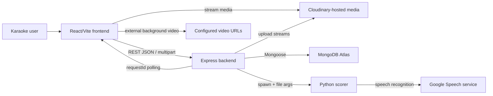
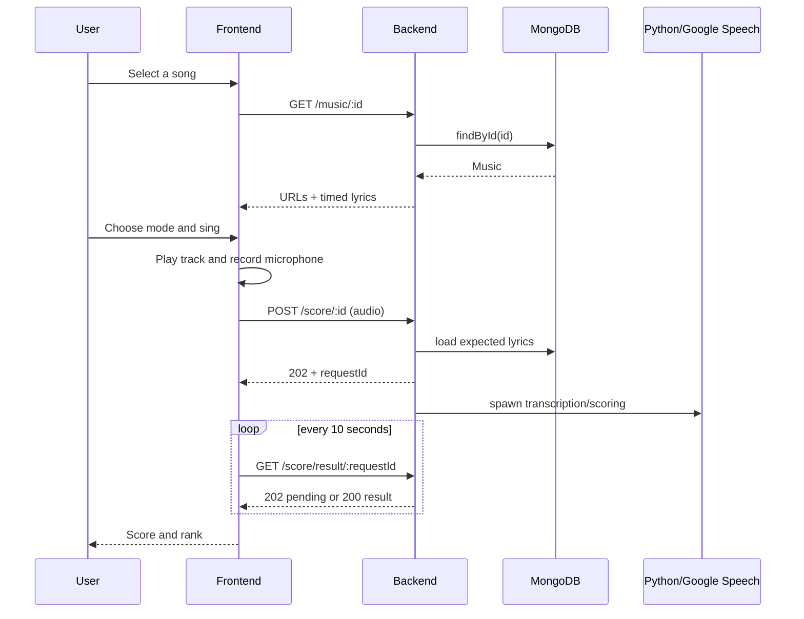

# Integration Architecture

## System context

## Cross-part contracts

| From | To | Type | Contract |
|---|---|---|---|
| Frontend `SelectMusic` | Backend | REST | `GET /musics` returns the catalog. |
| Frontend `SingMusic` | Backend | REST | `GET /music/:id` returns playback URLs and timed lyrics. |
| Frontend recorder | Backend | Multipart + async job | `POST /score/:id` accepts `audio` and returns `requestId`. |
| Frontend `MusicEnded` | Backend | Polling | `GET /score/result/:requestId` returns pending or final score. |
| Backend music controller | Cloudinary | SDK upload stream | Stores original track, instrumental, and cover art. |
| Backend controllers | MongoDB | Mongoose | Creates and reads Music documents. |
| Backend score controller | Python | Child process/stdout | Passes recording path and expected lyrics; reads score then transcription. |

The implemented UI does not call `POST /upload-music`; it is an external/admin-style API without an included client.

## Primary data flow

## Coupling and failure behavior

- `VITE_API_URL` is the only frontend/backend location contract; no shared types or generated client prevent drift.
- Frontend progress depends on polling an in-memory result located in the same backend process that accepted the upload.
- Backend startup is blocked by MongoDB connectivity.
- Score completion depends on filesystem writes, Python, FFmpeg, Google network access, and parsable stdout.
- The frontend has no terminal UI for backend/Python failure, so it can poll indefinitely.
- Cloudinary and MongoDB writes are not transactional; partial uploads may remain orphaned.

## Recommended target boundary

Keep the current two-part shape, but introduce explicit adapters:

- shared request/response schemas and an API client;
- backend service/repository layers for Music;
- a durable scoring queue/store with status and error states;
- isolated object-storage, speech-provider, and temporary-file adapters;
- health/readiness checks for MongoDB and worker dependencies.

